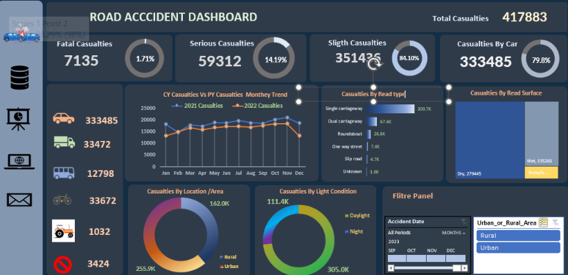

https://github.com/jagdish211/Road-Accident-Excel-Dashboard/blob/main/dashboard/Dashboard.png
# 🚗 Road Accident Data Analysis & Excel Dashboard

An end-to-end **Road Accident Data Analysis project using Microsoft Excel**.

This project follows a complete data analytics workflow starting from raw accident data, followed by data cleaning, preprocessing, analysis, and finally the creation of an interactive Excel dashboard.

---

## 📊 Dashboard Preview




---

# 📌 Project Overview

The main objective of this project is to analyze road accident data and identify useful insights related to:

- Total Casualties
- Fatal Casualties
- Serious Casualties
- Slight Casualties
- Casualties by Vehicle Type
- Casualties by Road Type
- Casualties by Road Surface
- Casualties by Light Conditions
- Urban vs Rural Casualties
- Monthly Casualty Trends
- Accident Patterns

The project is divided into multiple stages to demonstrate a complete **Data Analyst workflow**.

---

# 🔄 Project Workflow

```text
Raw Data
   ↓
Data Cleaning
   ↓
Data Preprocessing
   ↓
Month & Year Creation
   ↓
Data Analysis
   ↓
Pivot Tables
   ↓
Data Visualization
   ↓
Interactive Dashboard
